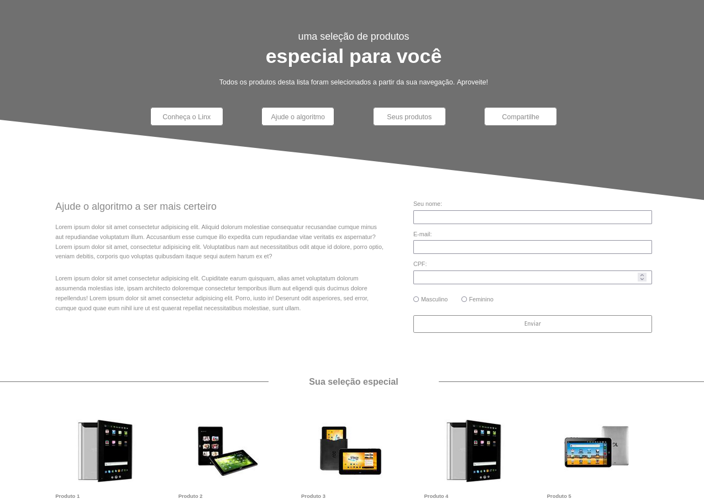
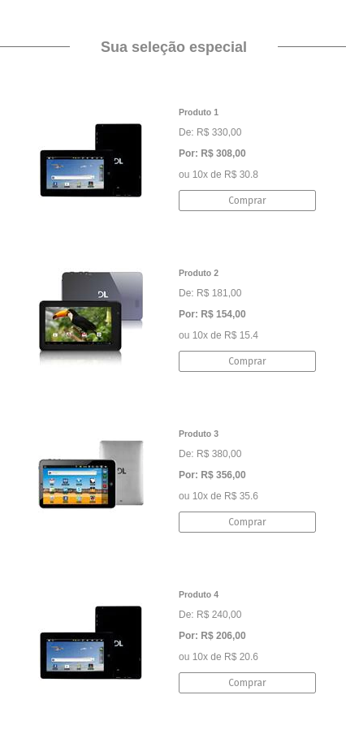

# Desafio | Frontend Developer

- Teste para a vaga de Frontend Developer Júnior.

- O teste aborda conhecimentos em HTML, CSS e Javascript.

## Índice

- [Visão Geral](#visao-geral)
  - [Sobre o desafio](#sobre-o-desafio)
  - [Screenshot](#screenshot)
  - [Links](#links)
  - [Como utilizar o site](#como-utilizar-o-site)
- [Meu processo](#meu-processo)
  - [Construído com](#construido-com)
  - [O que eu aprendi](#o-que-eu-aprendi)
- [Autor](#autor)

## Visao Geral

### Sobre o desafio

O desafio consiste no desenvolvimento do layout de uma landing page com uma grade de produtos e um formulário de newsletter. Seu principal objetivo é transformar este layout em uma página funcional.

### Screenshot





### Links

- URL do repositório: [solução](https://github.com/thiagoa-martins/teste-landing-page)
- URL do site: [github pages](https://thiagoa-martins.github.io/teste-landing-page/)

### Como utilizar o site

- Acesse a URL do site acima
- Informe seus dados ou dados fictícios
- Experimente navegar nos formulários com TAB, ENTER ou o mouse
- Informe seus dados e envie
- Caso esteja tudo certo os dados serão enviados

## Meu processo

### Construido com

- Marcação HTML5 semântica
- Propriedades personalizadas de CSS
- Flexbox
- Primeiro fluxo de trabalho para desktop
- Javascript (Vanilla)


### O que eu aprendi

Neste projeto pude desenvolver principalmente minhas habilidades com Javascript, consumi dados de uma API, trabalhei com paginação de produtos, validação de dados enviados pelo usuário e boas práticas de programação como organização e reutização de código com funções.

Além de obter e melhorar conhecimentos de Html e Css como:  posicionamento de elementos, estilização, semântica, flexbox e responsividade.

```js
fetch("https://frontend-intern-challenge-api.iurykrieger.vercel.app/products?page=1")
.then(turnIntoJson)
.then(listProducts)
.then(displayProducts)

buttonMoreProducts.addEventListener("click", function() {
    fetch("https://frontend-intern-challenge-api.iurykrieger.vercel.app/products?page=1")
    .then(turnIntoJson)
    .then(newPage)  
});

function turnIntoJson(response) {
  return response.json();
}

function listProducts(response) {

    response.products.forEach(product => {
        products += `
            <div class="product">
                <div class="image">
                    
                </div>
                
                <div class="product-information">
                    <h4 class="title-product">Produto ${product.id + 1}</h4>
    
                    <p class="description">
                        ${product.description}
                    </p>
    
                    <span class="old-price">De: R$ ${product.oldPrice},00</span>
    
                    <span class="new-price">Por: R$ ${product.price},00<span>ou ${product.installments.count}x de R$ ${product.installments.value}</span></span>
    
                    <button class="button">Comprar</button>            
                </div>                 
            </div>
        `;
    });

    return products;
}

function displayProducts(products) {
    boxProducts.innerHTML = products;
}

function newPage(response) {
    const newPage = response.nextPage;
    
    fetch(`https://${newPage}`)
    .then(turnIntoJson)
    .then(listProducts)
    .then(displayProducts)
    
    buttonMoreProducts.classList.add("hidden-button");
}
```

## Autor

- Github - [thiagoa-martins](https://github.com/thiagoa-martins)
- Twitter - [thiagoa_martins](https://www.twitter.com/thiagoa_martins)
